# 🧹 Holistic Data Preparer
## 💳 Customer Credit Risk Dataset — End-to-End Data Preprocessing & Feature Engineering

> **A complete data-preparation workflow for a synthetic fintech customer credit-risk dataset, taking raw data through cleaning, outlier treatment, encoding, scaling, transformation, feature construction, and final ML-ready validation.**


---

## 📌 Table of Contents

- [🎯 Project Overview](#-project-overview)
- [💼 Business Problem](#-business-problem)
- [📊 Dataset](#-dataset)
- [🧩 Project Workflow](#-project-workflow)
- [🛠️ Techniques Implemented](#️-techniques-implemented)
- [📥 Data Acquisition](#-data-acquisition)
- [🧼 Data Cleaning & Quality](#-data-cleaning--quality)
- [🚨 Outlier Detection & Treatment](#-outlier-detection--treatment)
- [🏗️ Feature Engineering](#️-feature-engineering)
- [📏 Feature Scaling](#-feature-scaling)
- [🔄 Transformations](#-transformations)
- [🧱 Final ML Preprocessing Pipeline](#-final-ml-preprocessing-pipeline)
- [✅ Final Validation & Results](#-final-validation--results)
- [🖼️ Project Evidence](#️-project-evidence)
- [📁 Repository Structure](#-repository-structure)
- [🚀 How to Run](#-how-to-run)
- [📦 Outputs](#-outputs)
- [🔐 Dataset Disclaimer](#-dataset-disclaimer)
- [📚 References & Credits](#-references--credits)
- [👤 Author](#-author)

---

## 🎯 Project Overview

This project was completed as the **Holistic Data Preparer (Final Project)** for a data-preprocessing and feature-engineering workflow.

The main goal is not to build the final Machine Learning model yet. Instead, the focus is on preparing customer credit-risk data so that it is:

- clean and consistent
- suitable for analysis
- numerically and categorically encoded
- appropriately scaled and transformed
- enriched with useful engineered features
- validated for Machine Learning readiness

The workflow follows the practical journey a dataset would normally take before it is handed over to a Machine Learning modelling stage.

---

## 💼 Business Problem

Imagine a fintech company that wants to eventually predict whether a customer is likely to default on a loan.

The raw customer dataset contains a mixture of:

- 👤 demographic information
- 💰 financial information
- 📈 behavioural information
- 🗓️ dates
- 🏷️ categorical variables
- ⚠️ missing values
- 🚨 extreme observations
- 🔢 numerical variables with very different scales

A Machine Learning algorithm should not simply receive this raw table.

My role in this project is therefore to **prepare the data before modelling**.

### 🎯 Target Variable

| Value | Meaning |
|---:|---|
| `0` | No loan default |
| `1` | Loan default |

> **Important:** This project concentrates on preprocessing and feature engineering rather than training the final prediction model.

---

## 📊 Dataset

The primary dataset is a **synthetic Customer Credit Risk Dataset**.

### Main variables

| Category | Examples |
|---|---|
| 👤 Demographics | `age`, `gender`, `region`, `education_level`, `employment_type` |
| 💰 Financial | `annual_income`, `loan_amount`, `credit_score` |
| 📈 Behaviour | `transaction_count`, `spending_ratio`, `repayment_history` |
| 🗓️ Date | `join_date` |
| 🎯 Target | `default_flag` |
| 🆔 Identifier | `customer_id` |

The working dataset contains **100,000 customer records**. During the preprocessing exercises, controlled missing values are introduced into selected fields so that the required imputation techniques can be demonstrated.

---

## 🧩 Project Workflow

The project follows this overall pipeline:

```text
                 ┌─────────────────────────────┐
                 │       Raw Customer Data     │
                 │ CSV + JSON + SQL + API demo │
                 └──────────────┬──────────────┘
                                │
                                ▼
                 ┌─────────────────────────────┐
                 │   Data Understanding       │
                 │ info() • describe() •      │
                 │ profiling • quality checks  │
                 └──────────────┬──────────────┘
                                │
                                ▼
                 ┌─────────────────────────────┐
                 │     Missing Value Handling │
                 │ Mean/Median • Most Frequent│
                 │ Random Sample • KNN • MICE  │
                 └──────────────┬──────────────┘
                                │
                                ▼
                 ┌─────────────────────────────┐
                 │    Outlier Detection        │
                 │ Z-score • IQR • Percentile  │
                 │        • Winsorization      │
                 └──────────────┬──────────────┘
                                │
                                ▼
                 ┌─────────────────────────────┐
                 │ Feature Engineering         │
                 │ Dates • Encoding • Binning  │
                 │       • Binarization        │
                 └──────────────┬──────────────┘
                                │
                                ▼
                 ┌─────────────────────────────┐
                 │ Scaling & Transformations   │
                 │ Standard • MinMax • Robust  │
                 │ Log • Box-Cox • Yeo-Johnson│
                 └──────────────┬──────────────┘
                                │
                                ▼
                 ┌─────────────────────────────┐
                 │ Feature Construction        │
                 │ DTI • Monthly Transactions  │
                 │ Spending-to-Income Ratio    │
                 └──────────────┬──────────────┘
                                │
                                ▼
                 ┌─────────────────────────────┐
                 │ Final ColumnTransformer     │
                 │ + Training/Test Processing  │
                 └──────────────┬──────────────┘
                                │
                                ▼
                 ┌─────────────────────────────┐
                 │     FINAL ML-READY DATA     │
                 │ Validation • Audit • Export │
                 └─────────────────────────────┘
```

### 🔎 Workflow in one sentence

**Understand → Clean → Treat Outliers → Engineer → Encode → Scale → Transform → Construct Features → Validate → Export**

---

## 🛠️ Techniques Implemented

| Project Area | Techniques Demonstrated |
|---|---|
| 🧠 Conceptual Foundation | Data Analysis, Data Science planning, ML problem framing, tensors |
| 📥 Data Acquisition | CSV, JSON, SQL/SQLite, dummy API |
| 🔍 Data Understanding | `.info()`, `.describe()`, data-quality checks, profiling |
| 🩹 Missing Values | Mean/Median, SimpleImputer, Most Frequent, Random Sample + Indicator, KNN, MICE/Iterative Imputation, Complete Case Analysis |
| 🚨 Outliers | Z-score, IQR, Percentile, Winsorization |
| 🗓️ Dates | Year, Month, Day, Weekday extraction |
| 🏷️ Categorical Encoding | Ordinal, Label, One-Hot |
| 🔢 Numerical Encoding | Binning, Binarization, Quantile Binning, K-Means Binning |
| 📏 Scaling | Standardization, Normalization, Min-Max, MaxAbs, Robust |
| 🔄 Transformations | Log, Reciprocal, Square Root, Box-Cox, Yeo-Johnson |
| 🏗️ Feature Construction | Debt-to-Income, Average Monthly Transactions, Spending-to-Income |
| 🧱 Pipeline | ColumnTransformer, Pipeline, train/test preprocessing |
| ✅ Validation | Missing, duplicate, infinite-value, data-type and target checks |

---

## 📥 Data Acquisition

The project demonstrates how data can be acquired from multiple sources before being brought into a larger preprocessing workflow.

| Source | Format | Purpose |
|---|---|---|
| Main customer dataset | CSV | Primary credit-risk information |
| Customer metadata | JSON | Additional customer information |
| Repayment history | SQL / SQLite | Loan repayment information |
| Economic indicators | Dummy API | External economic context |

The CSV remains the primary dataset for the rest of the project, while the other sources demonstrate the ability to work with different data formats.

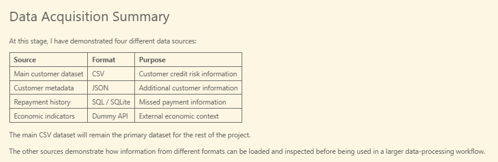

---

## 🧼 Data Cleaning & Quality

### 🔍 Initial understanding

Pandas was used to inspect the dataset structure, data types, dimensions and descriptive statistics.

A data-quality workflow was then used to identify:

- missing values
- duplicate values
- unique-value counts
- data types
- potential quality issues

### 📋 Profiling

A dedicated profiling report was generated for the customer credit-risk dataset.

The repository should include the generated HTML profiling report so that the result can be inspected independently of the notebook.

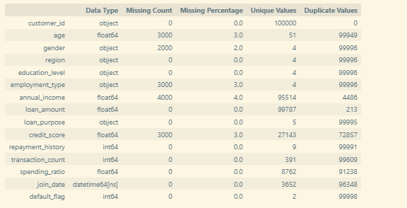

### 🩹 Missing-value treatment

Several strategies were compared rather than assuming that one method is suitable for every variable.

The demonstrated approaches include:

- Mean imputation
- Median imputation
- `SimpleImputer` for numerical variables
- Most-frequent categorical imputation
- Random-sample imputation with a missing indicator
- KNN imputation
- Iterative/MICE-style imputation
- Complete Case Analysis

For the final working dataset, simple and explainable methods were preferred where appropriate, while the more advanced techniques were retained as demonstrations and comparisons.

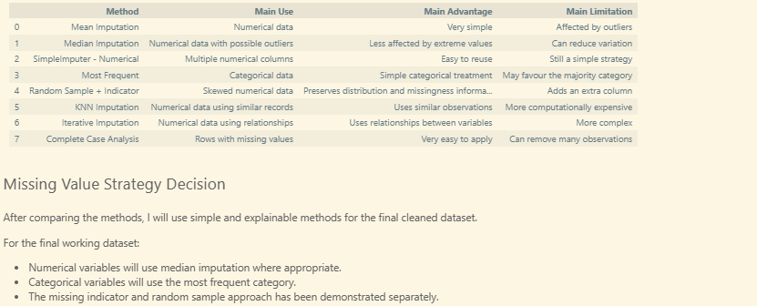

---

## 🚨 Outlier Detection & Treatment

Outliers were investigated using multiple approaches:

1. **Z-score**
2. **IQR**
3. **Percentile thresholds**
4. **Winsorization**

The financial variables, particularly income and loan amount, contain strongly skewed/extreme observations, making outlier analysis especially important.

### 📦 Before treatment

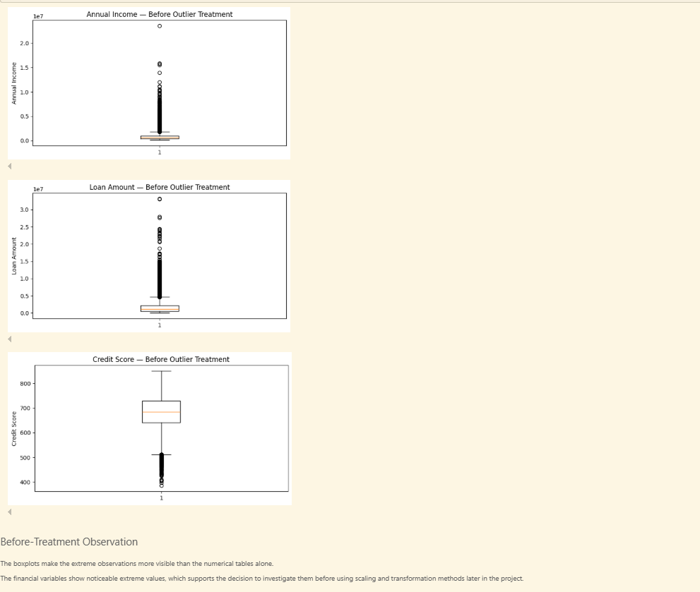

### ✂️ Winsorization

Winsorization was used to cap extreme observations rather than deleting customer records.

The before/after comparison confirms that the extreme ends of the selected distributions were treated while preserving the number of customer records.

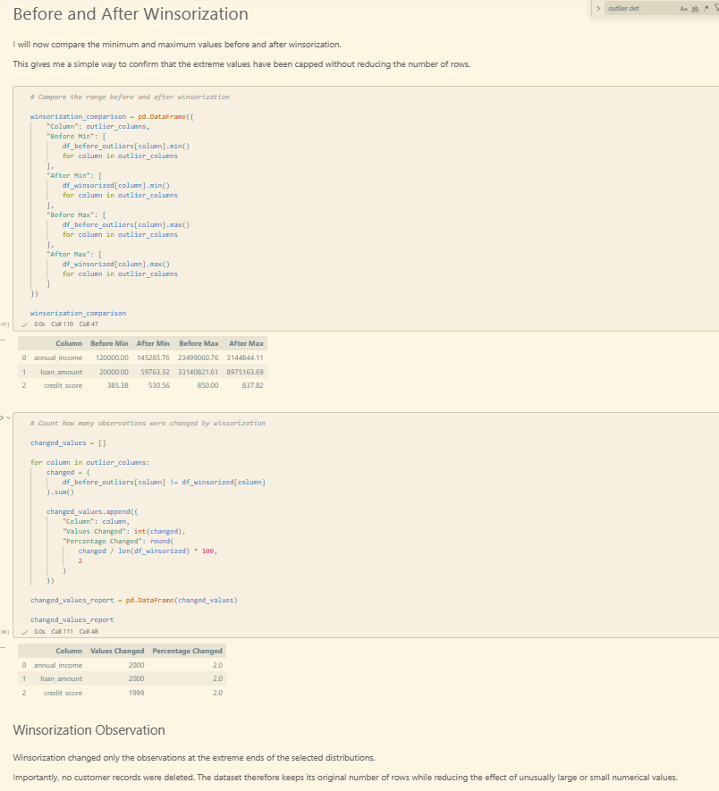

---

## 🏗️ Feature Engineering

Feature engineering was used to convert raw variables into representations that are more useful for later modelling.

### 🗓️ Date feature extraction

The `join_date` variable was used to derive:

- `join_year`
- `join_month`
- `join_day`
- `join_weekday`

### 🏷️ Categorical encoding

The project demonstrates:

- **Ordinal Encoding** for `education_level`
- **Label Encoding** for `gender`
- **One-Hot Encoding** for nominal variables such as `region` and `loan_purpose`

### 🔢 Numerical encoding

The project also demonstrates:

- equal-width binning
- quantile binning
- K-Means binning
- binarization

These techniques demonstrate different ways of converting continuous numerical information into useful categorical/binary representations.

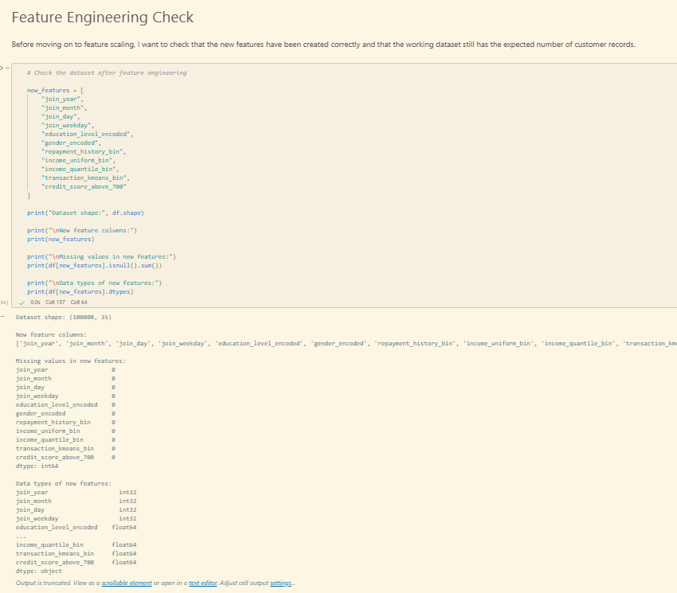

---

## 📏 Feature Scaling

Several scaling approaches were compared:

### Standardization
Centers data around a mean of approximately zero with unit variance.

### Normalization
Scales individual observations according to their vector norm.

### Min-Max Scaling
Maps values into a specified range, commonly 0–1.

### MaxAbs Scaling
Scales using the maximum absolute value.

### Robust Scaling
Uses median and interquartile range and is less sensitive to extreme values.

The project compares these methods so that the choice of scaler can be made based on the characteristics of the data rather than applying one method blindly.

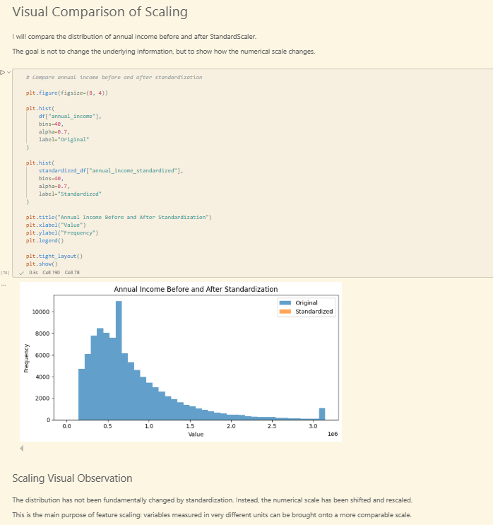

---

## 🔄 Transformations

### `FunctionTransformer`

Three transformations were demonstrated on `spending_ratio`:

- Log transformation
- Reciprocal transformation
- Square-root transformation

The skewness comparison was used to understand whether a transformation actually improved the distribution.

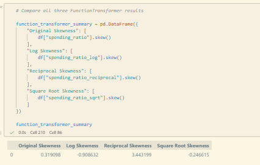

### `PowerTransformer`

Two power transformations were also demonstrated:

- **Box-Cox**
- **Yeo-Johnson**

Box-Cox is appropriate for strictly positive values, while Yeo-Johnson is more flexible because it can also handle zero and negative values.

The transformed financial variables were investigated because income and loan amount showed stronger skewness than several other numerical features.

---

## 🧱 Final ML Preprocessing Pipeline

The final preprocessing stage combines different treatments for different variable groups using **`ColumnTransformer`** and **`Pipeline`**.

The design separates:

### 💰 Financial numerical features
Median imputation → Yeo-Johnson transformation → StandardScaler

### 🔢 Other numerical features
Median imputation → StandardScaler

### 🎓 Education
Most-frequent imputation → Ordinal Encoding

### 🏷️ Nominal categorical variables
Most-frequent imputation → One-Hot Encoding

This approach is more appropriate than forcing every column through the same preprocessing steps.

The final preprocessing object is fitted using the training data before transforming the training and test sets.

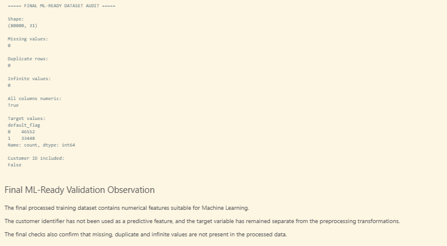

---

## 🧮 Feature Construction

Three requested derived features were created:

| New Feature | Construction | Purpose |
|---|---|---|
| `debt_to_income_ratio` | `loan_amount / annual_income` | Relates requested debt to annual income |
| `average_monthly_transactions` | `transaction_count / 6` | Converts six-month transaction count into a monthly average |
| `spending_to_income_ratio` | `spending_ratio / 100` | Stores the existing percentage ratio as a proportion |

The final feature-construction checks confirm that these ratio-based features contain no missing or infinite values.

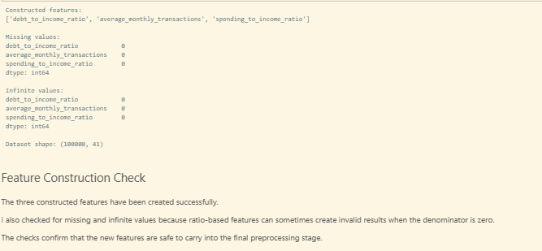

> **Note:** The dataset provides `spending_ratio` rather than a raw spending amount. Therefore, the final `spending_to_income_ratio` feature is a proportion conversion of that existing percentage, rather than an invented spending amount.

---

## ✅ Final Validation & Results

The final ML-ready dataset was audited programmatically.

### Final checks

| Validation | Result |
|---|---|
| Rows preserved | ✅ Passed |
| Missing values | ✅ None |
| Duplicate rows | ✅ None |
| All predictors numeric | ✅ Passed |
| Target exists | ✅ Passed |
| Target is binary | ✅ Passed |
| `customer_id` excluded from predictors | ✅ Passed |
| Infinite values | ✅ None |

The final preprocessing output contains:

- **80,000 training rows**
- **31 ML-ready columns**
- the binary `default_flag` target
- no missing values
- no duplicate rows
- no infinite values
- no `customer_id` predictor leakage

The complete processed dataset is also assembled and checked for final export.

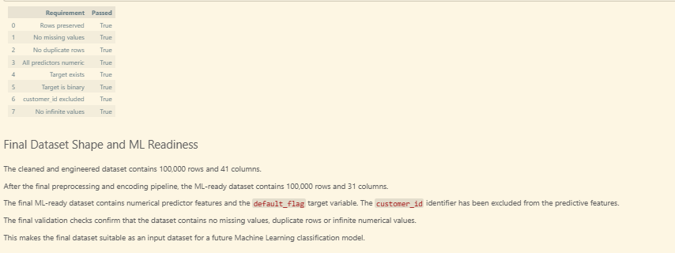


---

## 📈 Final Dataset

The project produces two useful CSV outputs:

### 1. Cleaned & engineered dataset

`customer_credit_risk_cleaned_engineered.csv`

This represents the cleaned working dataset after the preprocessing and feature-engineering stages.

### 2. ML-ready dataset

`customer_credit_risk_ml_ready.csv`

This represents the final transformed/encoded feature matrix together with the `default_flag` target.

The final ML-ready representation contains **100,000 records and 31 columns** after the complete preprocessing workflow.

---

## 🖼️ Project Evidence

The repository contains screenshots documenting the major stages of the workflow.

| Evidence | Screenshot |
|---|---|
| Project introduction | `SC01.png` |
| Tensor / NumPy concepts | `SC02.png` |
| Multi-source data acquisition | `SC03.png` |
| Data quality / profiling | `SC04.png` |
| Missing-value strategies | `SC05.png` |
| Outlier detection | `SC06.png` |
| Winsorization | `SC07.png` |
| Encoding & feature engineering | `SC08.png` |
| Scaling | `SC09.png` |
| FunctionTransformer | `SC10.png` |
| Feature construction | `SC11.png` |
| Final preprocessing / validation | `SC12.png` |
| Final audit / dataset readiness | `SC13.png` |

> 💡 The screenshots are supporting evidence. The notebook, generated datasets and profiling report are the primary project artifacts.

---

## 📁 Repository Structure

A professional repository can be organised like this:

```text
Holistic-Data-Preparer/
│
├── README.md
├── Holistic_Data_Preparer_Final.ipynb
├── requirements.txt
│
├── data/
│   ├── customer_credit_risk_100k.csv
│   ├── customer_metadata.json
│   └── loan_repayment.db
│
├── output/
│   ├── customer_credit_risk_cleaned_engineered.csv
│   ├── customer_credit_risk_ml_ready.csv
│   └── customer_credit_risk_data_quality_report.html
│
├── screenshots/
│   ├── SC01.png
│   ├── SC02.png
│   ├── SC03.png
│   ├── SC04.png
│   ├── SC05.png
│   ├── SC06.png
│   ├── SC07.png
│   ├── SC08.png
│   ├── SC09.png
│   ├── SC10.png
│   ├── SC11.png
│   ├── SC12.png
│   └── SC13.png
│
│
└── video/
    └── Project_Explanation.mp4
```

> **GitHub note:** If the final repository becomes too large because of CSV files or video files, GitHub Releases or Git LFS can be used rather than committing very large binaries directly.

---

## 🚀 How to Run

### 1️⃣ Clone the repository

```bash
git clone <YOUR_GITHUB_REPOSITORY_URL>
cd Holistic-Data-Preparer
```

### 2️⃣ Install dependencies

```bash
pip install -r requirements.txt
```

### 3️⃣ Launch Jupyter Notebook

```bash
jupyter notebook
```

### 4️⃣ Open

```text
Holistic_Data_Preparer_Final.ipynb
```

### 5️⃣ Run the notebook

Use **Kernel → Restart Kernel and Run All** to reproduce the complete workflow from the beginning.

> ⚠️ The notebook is designed as an educational preprocessing project. The dataset is synthetic and should not be interpreted as real financial/customer information.

---

## 📦 Outputs

The completed workflow produces:

- 📓 Jupyter Notebook
- 📊 Cleaned and engineered CSV
- 🤖 ML-ready CSV
- 📋 Data-quality/profiling HTML report
- 📸 Project evidence screenshots
- 📄 Project/theory documentation
- 🎥 Project explanation video

---

## 🔐 Dataset Disclaimer

This project uses **synthetic customer credit-risk data created for educational purposes**.

It does **not** represent real customers, real financial records, or real lending decisions.

The project is intended to demonstrate data preprocessing and feature-engineering techniques in a controlled educational environment.

---

## 📚 References & Credits

The notebook and project documentation give credit to the main technical resources used throughout the workflow.

### Official technical documentation

- **Pandas Documentation** — DataFrames, data inspection, CSV input/output and descriptive statistics.
- **NumPy Documentation** — arrays, dimensions and numerical operations.
- **SciPy Documentation** — statistical calculations used in preprocessing and outlier analysis.
- **Scikit-learn Documentation** — imputation, preprocessing, encoders, scalers, transformations, `Pipeline` and `ColumnTransformer`.
- **YData Profiling Documentation** — automated exploratory/data-quality profiling.

### Project source

- **Red & White Skill Education — Holistic Data Preparer (Final Project)** — project requirements, task structure and marking scheme.

### Dataset credit

- **Customer Credit Risk Dataset** — synthetic educational dataset generated for this project.

### AI assistance

AI assistance was used during the development process for **dataset design, preprocessing workflow planning, code assistance, explanations and documentation refinement**. The final notebook workflow was reviewed and executed as part of the project.

---

## 👤 Author

**Dushyant V**

---

## ⭐ Project Takeaway

> **Good Machine Learning starts with good data.**

This project demonstrates the complete preparation of a mixed-type customer dataset before modelling — from understanding and cleaning the raw information to constructing useful features and producing a validated ML-ready dataset.

**Understand → Clean → Transform → Engineer → Validate → Model**

---

<p align="center">
  <b>🧹 Clean Data • 🧠 Better Features • 🤖 ML-Ready Data</b>
</p>
